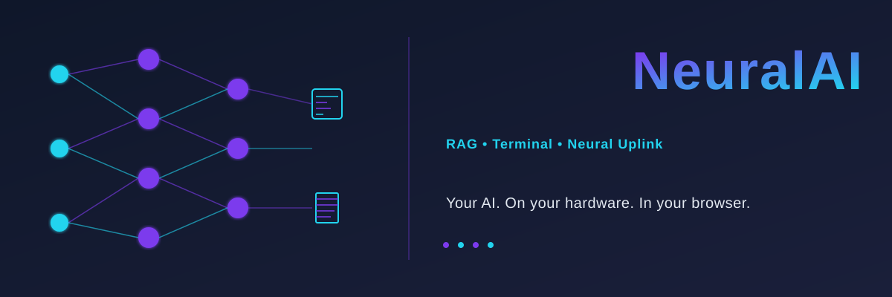
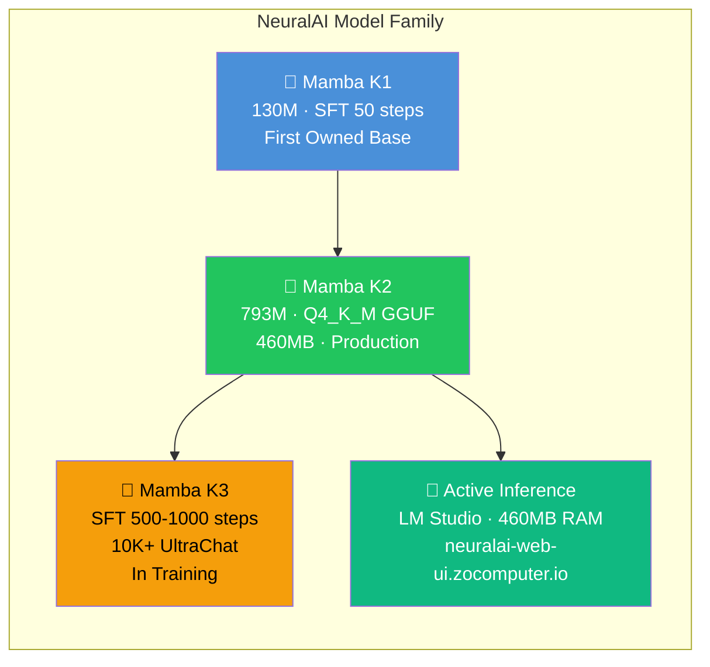

---
language:
  - en
library_name: peft
license: apache-2.0
tags:
  - lora
  - conversational
  - text-generation
  - peft
  - fine-tuned
  - mamba
  - ssm
  - neuralai
  - base-model
model_id: Subject-Emu-5259/NeuralAI
base_model: state-spaces/mamba-130m-hf
inference: false
---

# 🧠 NeuralAI: The Generative AI Engine

<p align="center">
  
</p>

<p align="center">
  <a href="https://github.com/Subject-Emu-5259/NeuralAI"></a>
  <a href="https://huggingface.co/Subject-Emu-5259/NeuralAI"></a>
  <a href="https://huggingface.co/Subject-Emu-5259/NeuralAI-Mamba-K1"></a>
  <a href="https://huggingface.co/Subject-Emu-5259/NeuralAI-Mamba-K2"></a>
  <a href="https://neuralai-web-ui-deandrewharris.zocomputer.io"></a>
</p>

---

## 📊 Repository Composition

| Language | Percentage |
| --- | --- |
| Python | 71.1% |
| HTML | 13.0% |
| JavaScript | 12.4% |
| CSS | 2.6% |
| Shell | 0.4% |
| Jupyter Notebook | 0.3% |
| Jinja | 0.2% |

**The High-Velocity AI Engine for Your Entire Vibe Stack**

NeuralAI is the central intelligence engine developed by **De'Andrew Preston Harris**. Conceived and engineered as an owned AI platform, it spans fine-tuned transformer models, custom SSM base models, DPO alignment, and a production web UI — all designed for local-first, private AI computing.

---

## 🏗️ Model Family



### Complete Lineup

| Model | Architecture | Params | Training | Status | Location |
|-------|-------------|--------|----------|--------|----------|
| **Mamba K1** | Mamba SSM | 130M | SFT LoRA v2 merged (500 steps, 1K UltraChat, intel format) + Q4_K_M GGUF | ✅ Published HF + SFT v3 running | `Subject-Emu-5259/NeuralAI-Mamba-K1` |
| **Mamba K2** | Mamba SSM | 793M | Base pretrained — SFT queued (Q4_K_M GGUF) | ⚠️ Base model only | `Subject-Emu-5259/NeuralAI-Mamba-K2` |
| **Mamba K3** | Mamba SSM | 2.8B | Base pretrained — SFT queued | ⚠️ Base model only | local `models/mamba-k3-base/` |

### Why Mamba SSM

| Property | Benefit |
|----------|--------|
| Complexity | \(O(n)\) linear — scales to long context efficiently |
| Inference | Fast at any sequence length, not just short prompts |
| Memory | K2 runs at 460MB (Q4_K_M GGUF) — fits on any device |
| Ownership | NeuralAI trains and merges all release weights on top of public Mamba SSM bases — every released GGUF is a fully merged model, not a raw base |
| Ecosystem | LM Studio, llama.cpp, Hugging Face — mature deployment options |

---

## 🌟 Vision & Manifesto

NeuralAI doesn't just predict text; it *operates the work*. The core mission is to create a multimodal generative system that bridges the gap between raw idea and execution. By fusing autoregressive generation with adaptive agency, NeuralAI becomes more than a chatbot — it is a persistent, reasoning partner.

Born from resilience and ambition in Memphis, Tennessee and West Memphis, Arkansas, NeuralAI represents a forward-thinking approach to personal, private AI computing.

---

## 🛠️ Tech Stack & Architecture

NeuralAI is built on a high-performance architecture that decouples the inference engine from the web interface, enabling lightweight cloud hosting with powerful local inference.

### Core Stack

- **Production Model**: Mamba K2 793M Q4_K_M GGUF (460MB) via llama.cpp — active inference engine
- **Model Family**: Mamba K1 (130M, SFT LoRA retry) → Mamba K2 (793M base GGUF) → Mamba K3 (2.8B base)
- **Inference Engine**: llama.cpp server with a custom `neuralai-intel` chat format (vocabulary-friendly for GPT-NeoX / Mamba tokenizers)
- **Vocal Identity**: Andrew (Warm/Multilingual) — Optional voice synthesis integration
- **Web Interface**: Custom Flask UI served via Zo Computer at `neuralai-web-ui-deandrewharris.zocomputer.io`
- **Tool Chain**: 10 live slash commands (/web, /fetch, /browse, /research, /img, /speak, /summarize, /translate, /news, /yt) + NL→Tool Router

### Future Scale Path

| Stage | Params | Goal | Status |
|-------|--------|------|--------|
| **Mamba K1 SFT v2** | 130M | Merge + Q4_K_M/F16 GGUF + publish to HF | ✅ Done |
| **Mamba K1 SFT v3** | 130M | 1000-step continuation on 10K UltraChat | 🔄 Active |
| **Mamba K2 SFT** | 793M | SFT LoRA 500 steps → merge → Q4_K_M GGUF | 📋 Next |
| **Mamba K3 SFT** | 2.8B | SFT LoRA 1000 steps → merge → Q4_K_M GGUF | 📋 Next |
| **Mamba 2B/3B** | ~2-3B | Scaled SSM architecture, benchmarks | 📋 Planned |

---

## ✨ Key Features & Capabilities

### 💬 Multimodal Chat & Agentic Intelligence

- **High-Velocity Text Inference**: Fast, local inference with deep context awareness
- **Deep Reasoning Mode**: Integration of test-time compute and chain-of-thought reasoning
- **Autonomous Agentic Workflows**: Agent-mode interaction with browser, terminal, and third-party apps
- **Live S2S (Speech-to-Speech)**: Real-time voice interaction with integrated microphone interface
- **Identity Vault & Memory**: Persistent user memory and rule constraints

### 🔧 Developer & Engineering Tools

- **10 Web Tool Commands**: Search, fetch, browse, research, image gen, TTS, summarize, translate, news, YouTube
- **NL→Tool Router**: Natural language web requests auto-routed to the right tool
- **Model Manager**: CLI switching between all registered models
- **Benchmark Suite**: Perplexity, generation diversity, MMLU-style, reasoning tests

---

## 🚀 Model Lineage

```mermaid
timeline
    title NeuralAI Model Evolution
           : Custom 135M base SFT
    2026 Q3 : Mamba K1 — First owned base
           : 130M SSM · Proof of Concept
    2026 Q3 : Mamba K2 — Scaled base
           : 790M Q4_K_M · GGUF ready
    2026 Q3 : Mamba K3 — Full SFT
           : 500-1000 steps · 10K+ samples
    2026 Q4 : Mamba 2B/3B — Next scale targets
           : 2B SSM → 3B Core Intelligence
```

---

## 🚀 Deployment


```bash
# 1. Start the inference service
cd NeuralAI
supervisorctl -c /etc/zo/supervisord-user.conf restart neuralai-lmstudio

# 2. Start the web UI service
python3 services/webui_service.py
```

### Mamba K2 (LM Studio / llama.cpp)

```bash
# Download from HuggingFace
huggingface-cli download Subject-Emu-5259/NeuralAI-Mamba-K2 \
  mamba-790m-hf.Q4_K_M.gguf --local-dir ./models/

# Serve with the NeuralAI chat format
python3 services/lmstudio_server.py \
  --model models/mamba-790m-hf.Q4_K_M.gguf \
  --chat_format neuralai-intel \
  --port 1234
```

### Mamba K1 (Python)

```python
from transformers import MambaForCausalLM, AutoTokenizer

model = MambaForCausalLM.from_pretrained("Subject-Emu-5259/NeuralAI-Mamba-K1")
tokenizer = AutoTokenizer.from_pretrained("Subject-Emu-5259/NeuralAI-Mamba-K1")
```

### Containerized Deployments

| Deployment | Dockerfile | Stack | Status |
| --- | --- | --- | --- |
| **Web Chat** | `services/start_lmstudio.sh` + Flask UI | llama.cpp + `neuralai-web-ui.zocomputer.io` | ✅ Live |

---

## 🌌 NeuralAI Ecosystem

The standalone software implementation of the NeuralAI core is **NeuralLabs**:
👉 [github.com/Subject-Emu-5259/NeuralLabs](https://github.com/Subject-Emu-5259/NeuralLabs)

**Software Downloads**: Latest beta builds available at:
👉 [zo.pub/deandrewharris/neurallabs-beta](https://zo.pub/deandrewharris/neurallabs-beta)

---

## 📈 Current State & Active Goals

- **Legacy DPO v17 / Air 135M / SmolLM2-360M**: Retired and removed from the repository
- **Mamba K1**: SFT LoRA v2 merged and published to Hugging Face; a longer v3 SFT run is in progress to reduce repetition
- **Mamba K2**: Base pretrained GGUF ready — awaiting SFT
- **Mamba K3**: 2.8B base downloaded — awaiting SFT
- **Last Maintenance**: August 1, 2026 (Mamba Era — K1 SFT v2 merge, Q4_K_M GGUF, HF publish + v3 SFT started)

---

## 👤 Creator

Built by **De'Andrew Preston Harris** ([@deandrewharris94](https://linkedin.com/in/deandrewharris94/)) with Google Gemini AI Studio/Colab collaboration.

From Memphis, Tennessee. Raised in West Memphis, Arkansas. AI Software Engineering at Maestro College.

---

# NeuralAI → Hugging Face sync is live
