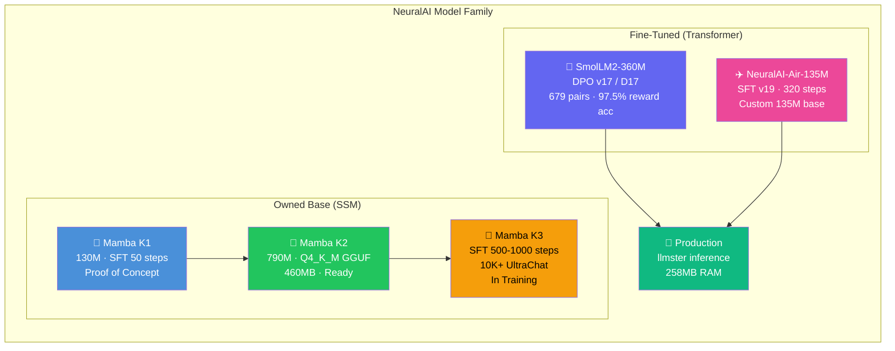
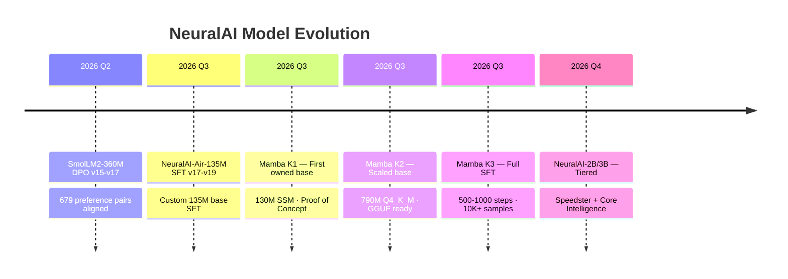

---
language:
  - en
library_name: peft
license: apache-2.0
tags:
  - lora
  - conversational
  - text-generation
  - peft
  - smollm2
  - dpo
  - fine-tuned
  - mamba
  - ssm
  - neuralai
model_id: Subject-Emu-5259/NeuralAI
base_model: HuggingFaceTB/SmolLM2-360M-Instruct
inference: false
---

# 🧠 NeuralAI: The Generative AI Engine

<p align="center">
  
</p>

<p align="center">
  <a href="https://github.com/Subject-Emu-5259/NeuralAI"></a>
  <a href="https://huggingface.co/Subject-Emu-5259/NeuralAI"></a>
  <a href="https://huggingface.co/Subject-Emu-5259/NeuralAI-Mamba-K1"></a>
  <a href="https://huggingface.co/Subject-Emu-5259/NeuralAI-Mamba-K2"></a>
  <a href="https://neuralai-web-ui-deandrewharris.zocomputer.io"></a>
</p>

---

## 📊 Repository Composition

| Language | Percentage |
| --- | --- |
| Python | 71.1% |
| HTML | 13.0% |
| JavaScript | 12.4% |
| CSS | 2.6% |
| Shell | 0.4% |
| Jupyter Notebook | 0.3% |
| Jinja | 0.2% |

**The High-Velocity AI Engine for Your Entire Vibe Stack**

NeuralAI is the central intelligence engine developed by **De'Andrew Preston Harris**. Conceived and engineered as an owned AI platform, it spans fine-tuned transformer models, custom SSM base models, DPO alignment, and a production web UI — all designed for local-first, private AI computing.

---

## 🏗️ Model Family



### Complete Lineup

| Model | Architecture | Params | Training | Status | Location |
|-------|-------------|--------|----------|--------|----------|
| **SmolLM2-360M DPO v17** | Transformer | 360M | DPO 679 pairs | ✅ Production | `Subject-Emu-5259/NeuralAI` |
| **NeuralAI-Air-135M SFT v19** | Transformer | 135M | SFT 320 steps | ✅ Production | `Subject-Emu-5259/NeuralAI-Air-135M-SFT-v19` |
| **Mamba K1** | Mamba SSM | 130M | SFT 50 steps | ✅ Complete | `Subject-Emu-5259/NeuralAI-Mamba-K1` |
| **Mamba K2** | Mamba SSM | 790M | Q4_K_M GGUF | ✅ Complete | `Subject-Emu-5259/NeuralAI-Mamba-K2` |
| **Mamba K3** | Mamba SSM | 790M | SFT 500-1000 steps | 🔄 In Training | `training/mamba-k3/` |

### Mamba vs Transformer

| Property | Transformer (SmolLM2) | Mamba SSM (K1/K2/K3) |
|----------|----------------------|----------------------|
| Complexity | \(O(n^2)\) attention | \(O(n)\) linear |
| Long context | Memory-hungry | Efficient |
| Inference speed | Slower at length | Fast at any length |
| Memory | 258MB (Q4_K_M 360M) | 460MB (Q4_K_M 790M) |
| Ecosystem | Mature (HuggingFace, llama.cpp) | Growing |
| NeuralAI owns weights? | LoRA adapter only | ✅ Full merged model |

---

## 🌟 Vision & Manifesto

NeuralAI doesn't just predict text; it *operates the work*. The core mission is to create a multimodal generative system that bridges the gap between raw idea and execution. By fusing autoregressive generation with adaptive agency, NeuralAI becomes more than a chatbot — it is a persistent, reasoning partner.

Born from resilience and ambition in Memphis, Tennessee and West Memphis, Arkansas, NeuralAI represents a forward-thinking approach to personal, private AI computing.

---

## 🛠️ Tech Stack & Architecture

NeuralAI is built on a high-performance architecture that decouples the inference engine from the web interface, enabling lightweight cloud hosting with powerful local inference.

### Core Stack

- **Production Models**: SmolLM2-360M-Instruct (DPO v17) + NeuralAI-Air-135M (SFT v19)
- **Owned Base Models**: Mamba K1 (130M) → Mamba K2 (790M GGUF) → Mamba K3 (SFT training)
- **Inference Engine**: [llmster](https://lmstudio.ai/docs/cli) (LM Studio headless) — OpenAI-compatible API with continuous batching, running via llama.cpp
- **Vocal Identity**: Andrew (Warm/Multilingual) — Optional voice synthesis integration
- **Web Interface**: Custom Flask UI served via Zo Computer at `neuralai-web-ui-deandrewharris.zocomputer.io`
- **Tool Chain**: 10 live slash commands (/web, /fetch, /browse, /research, /img, /speak, /summarize, /translate, /news, /yt) + NL→Tool Router

### Tiered Architecture (Target)

| Tier | Model | Params | Role | Status |
|------|-------|--------|------|--------|
| **Speedster** | NeuralAI-2B | ~2B | Fast chat, simple queries | Planned |
| **Core Intelligence** | NeuralAI-3B | ~3B | Deep reasoning, multi-step | Planned |
| **Owned Base** | Mamba K3 | 790M | NeuralAI's own SSM model | In Training |

---

## ✨ Key Features & Capabilities

### 💬 Multimodal Chat & Agentic Intelligence

- **High-Velocity Text Inference**: Fast, local inference with deep context awareness
- **Deep Reasoning Mode**: Integration of test-time compute and chain-of-thought reasoning
- **Autonomous Agentic Workflows**: Agent-mode interaction with browser, terminal, and third-party apps
- **Live S2S (Speech-to-Speech)**: Real-time voice interaction with integrated microphone interface
- **Identity Vault & Memory**: Persistent user memory and rule constraints

### 🔧 Developer & Engineering Tools

- **10 Web Tool Commands**: Search, fetch, browse, research, image gen, TTS, summarize, translate, news, YouTube
- **NL→Tool Router**: Natural language web requests auto-routed to the right tool
- **Model Manager**: CLI switching between all registered models
- **Benchmark Suite**: Perplexity, generation diversity, MMLU-style, reasoning tests

---

## 🚀 Model Lineage



---

## 🚀 Deployment

### Production (llmster — live)

```bash
# 1. Install llmster
curl -fsSL https://lmstudio.ai/install.sh | bash
export PATH="$HOME/.lmstudio/bin:$PATH"

# 2. Download model
lms import /path/to/SmolLM2-360M-Instruct-Q4_K_M.gguf \
  --user-repo "bartowski/SmolLM2-360M-Instruct-GGUF" -y
lms load smollm2-360m-instruct -y --identifier smollm2

# 3. Start inference
lms server start --port 1234

# 4. Start NeuralAI
cd NeuralAI
LLM_BACKEND=lmstudio LLM_API_URL=http://localhost:1234/v1 LLM_MODEL=smollm2 \
  python3 services/neural_core_service.py
```

### Mamba K2 (LM Studio)

```bash
# Download from HuggingFace
huggingface-cli download Subject-Emu-5259/NeuralAI-Mamba-K2 \
  mamba-790m-hf.Q4_K_M.gguf --local-dir ./models/

# Load in LM Studio: File → Load Model → select mamba-790m-hf.Q4_K_M.gguf
```

### Mamba K1 (Python)

```python
from transformers import MambaForCausalLM, AutoTokenizer

model = MambaForCausalLM.from_pretrained("Subject-Emu-5259/NeuralAI-Mamba-K1")
tokenizer = AutoTokenizer.from_pretrained("Subject-Emu-5259/NeuralAI-Mamba-K1")
```

### Containerized Deployments

| Deployment | Dockerfile | Stack | Status |
| --- | --- | --- | --- |
| **Gradio Demo** | `gradio_space/Dockerfile` | Gradio 6.x chat UI | ✅ Built |
| **Flask Web Chat** | `webui_space/Dockerfile` | Flask + `neural_core_service.py` | 🚀 Ready |

---

## 🌌 NeuralAI Ecosystem

The standalone software implementation of the NeuralAI core is **NeuralLabs**:
👉 [github.com/Subject-Emu-5259/NeuralLabs](https://github.com/Subject-Emu-5259/NeuralLabs)

**Software Downloads**: Latest beta builds available at:
👉 [zo.pub/deandrewharris/neurallabs-beta](https://zo.pub/deandrewharris/neurallabs-beta)

---

## 📈 Current State & Active Goals

- **DPO v17 (D17)**: Complete — 679 pairs, 97.5% reward accuracy, deployed
- **Air 135M SFT v19**: Complete — 320 steps, deployed
- **Mamba K1**: Complete — First owned SSM base model
- **Mamba K2**: Complete — 790M GGUF ready for LM Studio
- **Mamba K3**: Training — 500-1000 steps on 10K+ UltraChat
- **Strategic Transition**: Moving from 135M/360M to multi-tier 2B/3B + owned Mamba SSM
- **Inference**: llmster (LM Studio headless) — 258MB RAM vs 5GB PyTorch
- **Last Maintenance**: August 1, 2026 (Mamba Era — K1, K2 published; K3 training)

---

## 👤 Creator

Built by **De'Andrew Preston Harris** ([@deandrewharris94](https://linkedin.com/in/deandrewharris94/)) with Google Gemini AI Studio/Colab collaboration.

From Memphis, Tennessee. Raised in West Memphis, Arkansas. AI Software Engineering at Maestro College.

---

# NeuralAI → Hugging Face sync is live
