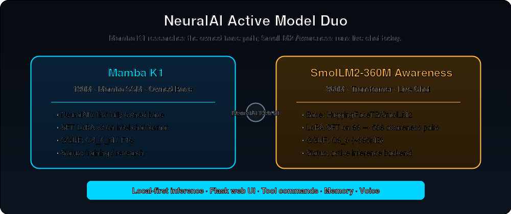
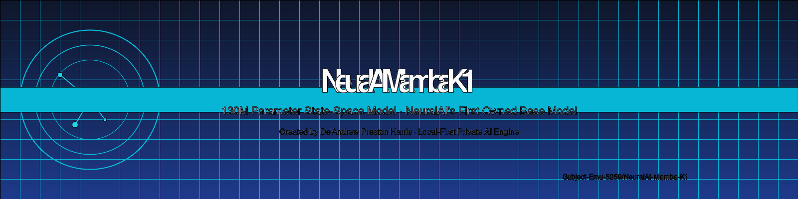
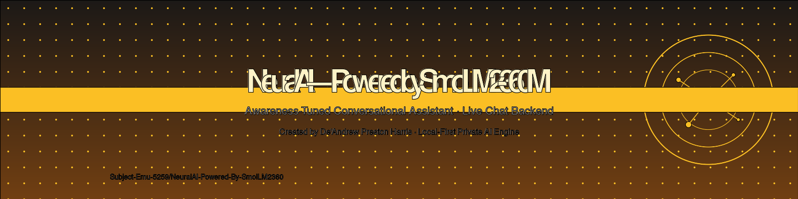
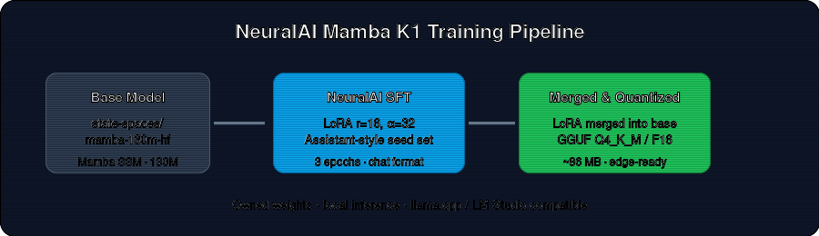
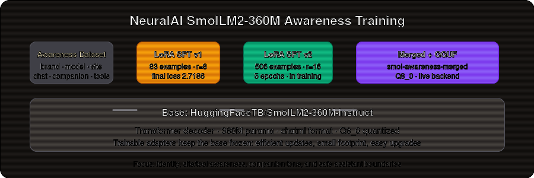

---
language:
  - en
library_name: peft
license: apache-2.0
tags:
  - neuralai
  - smollm2
  - mamba
  - ssm
  - lora
  - conversational
  - text-generation
  - peft
  - fine-tuned
  - awareness-tuning
inference: false
---

<p align="center">
  
</p>

<h1 align="center">🧠 NeuralAI — The Generative AI Engine</h1>

<p align="center">
  <strong>Your AI. On your hardware. In your browser.</strong>
</p>

<p align="center">
  <a href="https://github.com/Subject-Emu-5259/NeuralAI"></a>
  <a href="https://huggingface.co/Subject-Emu-5259"></a>
  <a href="https://huggingface.co/Subject-Emu-5259/NeuralAI-Mamba-K1"></a>
  <a href="https://huggingface.co/Subject-Emu-5259/NeuralAI-Powered-By-SmolLM2360"></a>
</p>

---

## 📊 Repository Composition

| Language | Percentage |
| --- | --- |
| Python | 71.1% |
| HTML | 13.0% |
| JavaScript | 12.4% |
| CSS | 2.6% |
| Shell | 0.4% |
| Jupyter Notebook | 0.3% |
| Jinja | 0.2% |

---

## 🚀 What is NeuralAI?

**NeuralAI** is a local-first, private generative-AI platform founded and built by **De'Andrew Preston Harris** (D. Harris / Dre). It is designed to be more than a chatbot — NeuralAI is an owned AI engine that combines fine-tuned transformer models, a custom Mamba SSM base model, DPO/SFT alignment pipelines, and a full web workspace with chat, terminal, files, tools, and voice.

The current active model fleet is intentionally lean: **two models**, one mission — prove that small, owned, well-tuned models can deliver a fast, private, and personal AI experience.

---

## 🏗️ NeuralAI Model Fleet

<p align="center">
  
</p>

| Model | Architecture | Parameters | Role | Status | Hugging Face |
|-------|-------------|------------|------|--------|--------------|
| **🧬 Mamba K1** | Mamba SSM (State Space Model) | 130M | NeuralAI's first fully owned base model | 🔬 R&D / chat training in progress | [NeuralAI-Mamba-K1](https://huggingface.co/Subject-Emu-5259/NeuralAI-Mamba-K1) |
| **🧠 NeuralAI Powered by SmolLM2‑360M** | Transformer decoder + NeuralAI LoRA | 360M (base) | Live chat backend, awareness-tuned | ⚡ Active inference model | [NeuralAI-Powered-By-SmolLM2360](https://huggingface.co/Subject-Emu-5259/NeuralAI-Powered-By-SmolLM2360) |

### 🧬 Mamba K1 — First Owned Base Model

<p align="center">
  
</p>

Mamba K1 is NeuralAI's first **owned base model**. It is built on the `state-spaces/mamba-130m-hf` Mamba SSM architecture and represents the start of a fully custom model lineage independent of third-party base weights.

| Property | Value |
|----------|-------|
| **Architecture** | Mamba SSM — `MambaForCausalLM` |
| **Parameters** | 130M |
| **Hidden size** | 768 |
| **Layers** | 24 |
| **State size** | 16 |
| **Vocabulary** | 50,280 |
| **Base model** | `state-spaces/mamba-130m-hf` |
| **Training** | LoRA SFT, chat-format repair, iterative v2/v3 GGUF merges |
| **Formats** | Merged safetensors, Q4_K_M GGUF, F16 GGUF |
| **Status** | R&D — chat-coherence training in progress |
| **HF Repo** | [Subject-Emu-5259/NeuralAI-Mamba-K1](https://huggingface.co/Subject-Emu-5259/NeuralAI-Mamba-K1) |

**What Mamba K1 is learning:**
- Correct instruction-following with a vocabulary-safe "intel" chat format
- Assistant-style chat behavior (greetings, structured answers, refusals)
- NeuralAI identity and creator anchoring
- Step-by-step reasoning for coding, math, and writing prompts

### 🧠 NeuralAI Powered by SmolLM2‑360M — Live Chat Backend

<p align="center">
  
</p>

This model is a **locally tuned SmolLM2‑360M-Instruct** that powers NeuralAI's live web UI. It was trained on a curated awareness dataset so it knows who built it, what it is, what tools it can use, and how to behave as a helpful companion.

| Property | Value |
|----------|-------|
| **Base model** | `HuggingFaceTB/SmolLM2-360M-Instruct` |
| **Parameters** | 360M (base) |
| **Architecture** | Transformer decoder |
| **Fine-tune method** | LoRA SFT |
| **Training data v1** | 83 prompt/response pairs across 6 awareness categories |
| **Training data v2** | 506 prompt/response pairs, expanded categories + tools + refusal |
| **v1 LoRA rank/alpha** | 8 / 16 |
| **v2 LoRA rank/alpha** | 16 / 32 |
| **v1 final loss / steps** | 2.7186 / 30 (3 epochs) |
| **v2 final loss / steps** | 0.1252 / 320 (5 epochs) |
| **v2 runtime** | CPU-only, completed |
| **Active format** | `NeuralAI-Smol-Awareness-v2-Q8_0.gguf` (~369MB) |
| **Status** | ⚡ Live inference backend (v2 active) |
| **HF Repo** | [NeuralAI-Powered-By-SmolLM2360](https://huggingface.co/Subject-Emu-5259/NeuralAI-Powered-By-SmolLM2360) |

**What SmolLM2‑360M Awareness learned:**
- **Brand identity** — Says "NeuralAI" and names De'Andrew Preston Harris as creator when asked directly
- **Model self-awareness** — Describes itself as a 360M Transformer tuned by NeuralAI
- **Site/tool awareness** — Knows the web UI offers chat, terminal, files, settings, and slash commands
- **Assistant boundaries** — Refuses unsafe requests, explains limitations, does not claim consciousness
- **Companion tone** — Responds with empathy while redirecting serious emotional needs to human support

---

## 🔬 Training at a Glance

<p align="center">
  
  
</p>

| | Mamba K1 | SmolLM2 360M Awareness |
|---|---|---|
| **Objective** | Build NeuralAI's first owned Mamba SSM base | Make a small instruction model aware of NeuralAI |
| **Method** | SFT LoRA → merge → GGUF | LoRA SFT on awareness dataset |
| **Data** | Curated assistant seed set (reasoning, code, math, safety, creative) | v1: 83 pairs · v2: 506 pairs (brand, model, site, chat, tool, companion, refusal) |
| **Loss v1** | Research checkpoint: 11.69 | v1 2.7186 |
| **Loss v2** | — | v2 0.1252 |
| **Live** | Not yet selectable (training) | Serving chat as v2 |

Full training details are in [`docs/SMOL_AWARENESS_TRAINING_REPORT.md`](docs/SMOL_AWARENESS_TRAINING_REPORT.md) and [`docs/TRAINING_MANIFEST.md`](docs/TRAINING_MANIFEST.md).

---

## 🛠️ Usage

### Load the SmolLM2 adapter (Hugging Face PEFT)

```python
from peft import AutoPeftModelForCausalLM
from transformers import AutoTokenizer

model = AutoPeftModelForCausalLM.from_pretrained(
    "Subject-Emu-5259/NeuralAI-Powered-By-SmolLM2360",
    trust_remote_code=True,
)
tokenizer = AutoTokenizer.from_pretrained(
    "Subject-Emu-5259/NeuralAI-Powered-By-SmolLM2360",
    trust_remote_code=True,
)

messages = [{"role": "user", "content": "Who made you?"}]
inputs = tokenizer.apply_chat_template(
    messages, tokenize=True, add_generation_prompt=True, return_tensors="pt"
)
out = model.generate(**inputs, max_new_tokens=256)
print(tokenizer.decode(out[0][inputs.shape[1]:], skip_special_tokens=True))
```

### Load Mamba K1 (Transformers)

```python
from transformers import AutoModelForCausalLM, AutoTokenizer
import torch

model = AutoModelForCausalLM.from_pretrained(
    "Subject-Emu-5259/NeuralAI-Mamba-K1",
    torch_dtype=torch.float32,
    trust_remote_code=True,
)
tokenizer = AutoTokenizer.from_pretrained(
    "Subject-Emu-5259/NeuralAI-Mamba-K1",
    trust_remote_code=True,
)

messages = [{"role": "user", "content": "Write a haiku about debugging."}]
inputs = tokenizer.apply_chat_template(
    messages, tokenize=True, add_generation_prompt=True, return_tensors="pt"
)
out = model.generate(**inputs, max_new_tokens=128)
print(tokenizer.decode(out[0][inputs.shape[1]:], skip_special_tokens=True))
```

### Serve the live model (llama.cpp)

```bash
# Active model in production
python3 services/lmstudio_server.py \
  --model models/NeuralAI-Smol-Awareness-v2-Q8_0.gguf \
  --chat_format chatml \
  --port 1234
```

---

## 🌟 Why NeuralAI Exists

NeuralAI was founded by **De'Andrew Preston Harris**, an AI Software Engineering student at Maestro College, builder, and father from Memphis, TN / West Memphis, AR. The goal is to build **private, high-performance, personal generative AI** that doesn't just answer questions — it *operates the work*.

### Company & Brand

| | |
|---|---|
| **Founder & Architect** | De'Andrew Preston Harris (D. Harris / Dre) |
| **GitHub** | [Subject-Emu-5259](https://github.com/Subject-Emu-5259) |
| **LinkedIn** | [linkedin.com/in/deandrewharris94](https://linkedin.com/in/deandrewharris94/) |
| **Hugging Face** | [huggingface.co/Subject-Emu-5259](https://huggingface.co/Subject-Emu-5259) |
| **Headquarters** | Memphis, TN / West Memphis, AR (remote-first) |
| **Mission** | Local-first, owned AI that runs on your hardware, in your browser |

### Core Values

- **Ownership** — Train and merge your own weights, don't just rent someone else's API.
- **Privacy** — Local-first inference on your hardware.
- **Agency** — From assistant to operator: tools, terminal, files, browser, and voice.
- **Discipline** — Small models, tight alignment, fast iteration.

---

## 📦 Related Projects

- **NeuralLabs** — Standalone downloadable intelligence environment: [github.com/Subject-Emu-5259/NeuralLabs](https://github.com/Subject-Emu-5259/NeuralLabs)
- **Hype** — Streaming platform by the same builder
- **Dispatch HQ** — Operations/game-server project

---

## 📈 Current State

- **Legacy models retired:** Air-135M, K2/K3, old DPO adapters removed from the repository and model manager.
- **Active fleet:** Mamba K1 (R&D) + NeuralAI Powered by SmolLM2‑360M (live).
- **Default chat backend:** `smol-awareness-merged` Q8_0 GGUF.
- **Last docs update:** August 13, 2026.

---

## 👤 Creator

Built with precision and discipline by **De'Andrew Preston Harris**.

From Memphis, Tennessee. Raised in West Memphis, Arkansas. AI Software Engineering at Maestro College.

**NeuralAI — built different.**
