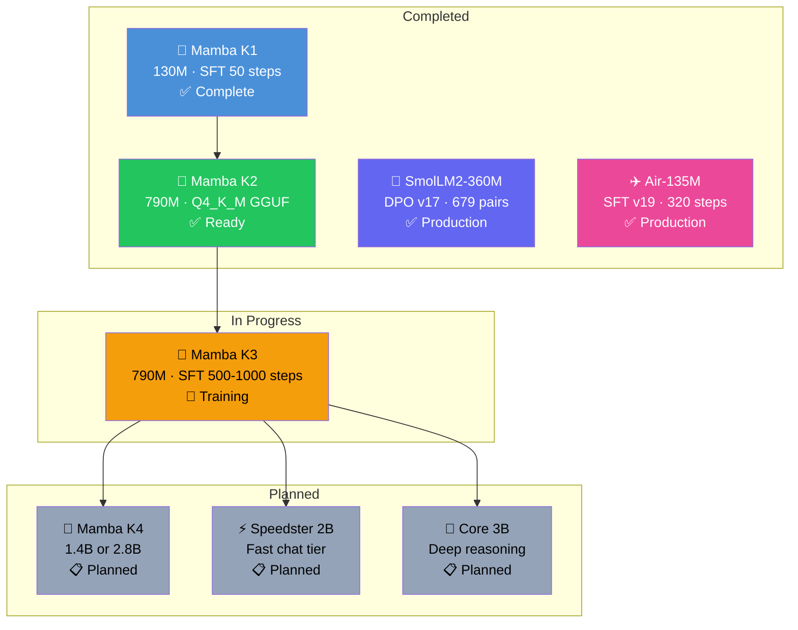

# 🚀 NeuralAI Development Roadmap

**Last Updated: August 1, 2026**

---

## ✅ Completed Milestones

### Mamba Era — Owned Base Models (July–August 2026)

| Milestone | Model | Status | Details |
|-----------|-------|--------|---------|
| **Mamba K1** | 130M SSM | ✅ Complete | First owned base model. SFT 50 steps on 1K UltraChat, loss 6.78, ~19 tok/s CPU. Merged safetensors on HF. |
| **Mamba K2** | 790M SSM | ✅ Complete | 6× scale-up from K1. Q4_K_M GGUF (460MB) ready for LM Studio / llama.cpp. |
| **Mamba K3** | 790M SSM | 🔄 In Training | SFT 500–1000 steps on 10K+ UltraChat. LoRA r=32 targeting in_proj/dt_proj/x_proj. |

### Fine-Tuned Models (Q2–Q3 2026)

| Milestone | Model | Status | Details |
|-----------|-------|--------|---------|
| **SmolLM2-360M DPO v17** | 360M Transformer | ✅ Production | 679 pairs, 97.5% reward accuracy, llmster inference (258MB RAM). |
| **NeuralAI-Air-135M SFT v19** | 135M Transformer | ✅ Production | 320 steps, custom base, Q4_K_M GGUF (269MB). |

### Infrastructure

- [x] llmster inference engine (258MB RAM vs 5GB PyTorch)
- [x] Model manager CLI with hot-swap between all models
- [x] NL→Tool Router (10 slash commands, natural language web intents)
- [x] Benchmark harness (`benchmarks/run_evals.py`)
- [x] Web UI chat formatting upgrades & structured info output
- [x] SmolLM2-360M removed from model manager (retired)

---

## 🔄 In Progress

### Mamba K3 — Full SFT Training

**Goal:** Turn the 790M Mamba SSM into a practically useful model.

| Phase | Detail |
|-------|--------|
| **Data** | 10K–15K UltraChat conversational samples |
| **Training** | 500–1000 SFT steps, LoRA rank 32 |
| **Target loss** | < 3.0 (base raw: ~6.5–8.0) |
| **Output** | Merged full model → Q4_K_M GGUF → LM Studio |
| **Colab** | `training/mamba-k3/colab_mamba_k2_train.ipynb` |

### Benchmark Suite

**Status:** Harness created (`benchmarks/run_evals.py`), pending execution.

| Benchmark | Metric |
|-----------|--------|
| Perplexity (WikiText-2) | Standard LM quality |
| Generation diversity | Distinct n-grams, repetition rate |
| MMLU-style (subset) | Factual knowledge |
| Reasoning (GSM8K-style) | Math word problems |
| Chat coherence | Multi-turn conversation quality |

---

## 🎯 Next Steps (Priority Order)

### 1. Complete Mamba K3 SFT Training
**Status**: 🔄 In progress on Google Colab

500–1000 SFT steps on 10K+ UltraChat samples. LoRA rank 32 on . Target loss < 3.0. Then: merge → GGUF Q4_K_M → benchmark.

### 2. Run Mamba K3 Benchmarks
Perplexity, MMLU, HellaSwag, ARC, GSM8K, generation diversity. Compare vs K1 baseline and vs SmolLM2-360M DPO.

### 3. Scale to Mamba-1.4B or Mamba-2.8B
Larger Mamba base → full SFT + DPO alignment → benchmark vs equivalent-size Transformers.

---

## 📊 Model Family Roadmap

---

## 🏗️ System Status

- **Inference**: llmster 0.0.19 running SmolLM2-360M-Instruct Q4_K_M GGUF (~258MB RAM)
- **Web UI**: Flask on Zo Computer at `neuralai-web-ui-deandrewharris.zocomputer.io`
- **Model Manager**: 4 registered models (mamba-k1, mamba-k2, neuralai-air-135m-v19, neuralai-v17-dpo)
- **Tool Chain**: 10 slash commands + NL→Tool Router — all live
- **Training**: Mamba K3 SFT on 10K+ UltraChat (Colab)

---

## 🔗 Key Links

- **GitHub**: [Subject-Emu-5259/NeuralAI](https://github.com/Subject-Emu-5259/NeuralAI)
- **HuggingFace**:
  - [NeuralAI (DPO v17)](https://huggingface.co/Subject-Emu-5259/NeuralAI)
  - [Mamba K1](https://huggingface.co/Subject-Emu-5259/NeuralAI-Mamba-K1)
  - [Mamba K2](https://huggingface.co/Subject-Emu-5259/NeuralAI-Mamba-K2)
- **Live UI**: [neuralai-web-ui-deandrewharris.zocomputer.io](https://neuralai-web-ui-deandrewharris.zocomputer.io)
