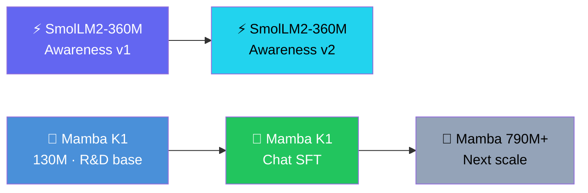

# 🚀 NeuralAI Development Roadmap

**Last Updated: August 13, 2026**

---

## ✅ Completed Milestones

### Awareness Tuned Chat Backend (August 2026)

| Milestone | Model | Details |
|-----------|-------|---------|
| **SmolLM2-360M Awareness v1** | 360M Transformer | 83-pair awareness dataset, LoRA r=8, 3 epochs, final loss 2.7186. Live Q8_0 GGUF inference. |
| **SmolLM2-360M Awareness v2** | 360M Transformer | 506-pair expanded dataset, LoRA r=16 / α=32, 5 epochs, final loss 0.1252, merged + GGUF activated as live backend. |

### Owned Base Models (July–August 2026)

| Milestone | Model | Details |
|-----------|-------|---------|
| **Mamba K1** | 130M SSM | First owned base model. Merged safetensors + Q4_K_M / F16 GGUFs on HF. |

### Infrastructure

- [x] llmster / llama.cpp inference engine
- [x] Model manager CLI switching between active models
- [x] Web UI streaming chat
- [x] Awareness dataset builder
- [x] Automated HF README/model-card sync workflow

---

## 🔄 In Progress

### Mamba K1 Chat SFT

| Phase | Detail |
|-------|--------|
| **Data** | Assistant-style conversation seed set |
| **Training** | LoRA SFT on mamba-130m-hf base |
| **Output** | merged model → Q4_K_M GGUF |
| **Goal** | First usable NeuralAI-owned chat model |

---

## 🎯 Next Steps

1. **Run** Mamba K1 chat SFT on GPU, merge, quantize, and publish.
2. **Evaluate** the live SmolLM2 v2 backend with held-out identity prompts and benchmark suite.
3. **Iterate** on K1 inference speed, chat format, and safety behavior.
4. **Scale** to a larger Mamba base only after K1 chat quality is proven.

---

## Model Family Roadmap

---

## 🏗️ System Status

- **Inference:** `models/NeuralAI-Smol-Awareness-Q8_0.gguf` via llama.cpp on port 1234
- **Web UI:** Flask on Zo Computer at `neuralai-web-ui-deandrewharris.zocomputer.io`
- **Model Manager:** 2 registered models (`mamba-k1`, `smollm2-360m`)
- **Training:** SmolLM2 awareness v2 in progress; K1 chat SFT queued

---

## 🔗 Key Links

- **GitHub:** [Subject-Emu-5259/NeuralAI](https://github.com/Subject-Emu-5259/NeuralAI)
- **HuggingFace:**
  - [NeuralAI-Powered-By-SmolLM2360](https://huggingface.co/Subject-Emu-5259/NeuralAI-Powered-By-SmolLM2360)
  - [NeuralAI-Mamba-K1](https://huggingface.co/Subject-Emu-5259/NeuralAI-Mamba-K1)
- **Live UI:** [neuralai-web-ui-deandrewharris.zocomputer.io](https://neuralai-web-ui-deandrewharris.zocomputer.io)
