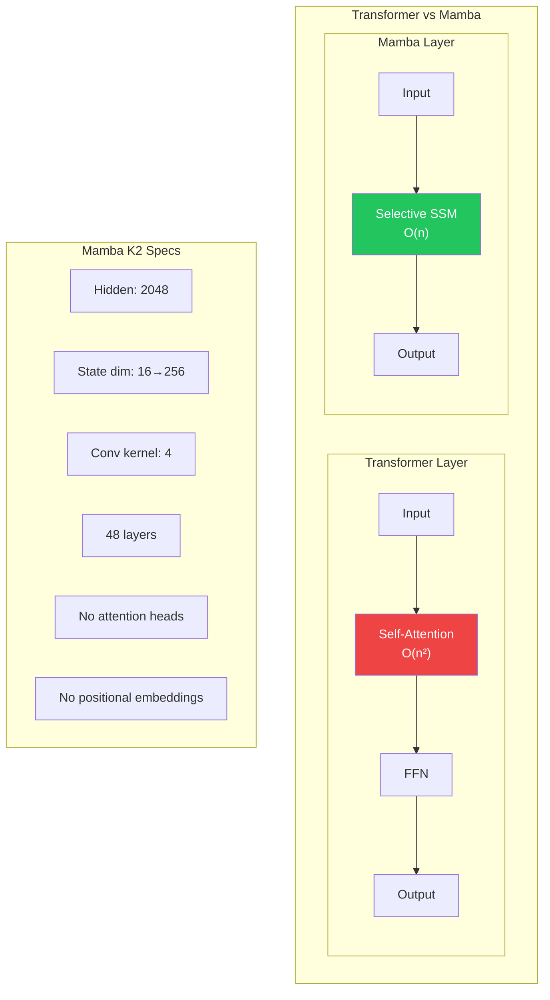
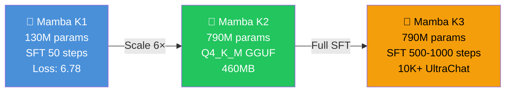

---
language:
  - en
license: apache-2.0
tags:
  - mamba
  - ssm
  - neuralai
  - gguf
  - quantized
  - text-generation
  - lm-studio
library_name: gguf
pipeline_tag: text-generation
model-index:
  - name: Mamba K2
    results: []
---

# 🧬 Mamba K2 — NeuralAI's Second Owned Base Model

> **Published**: August 1, 2026 · **Last Updated**: August 1, 2026

<p align="center">
  
  
  
  
  
</p>

<p align="center">
  <a href="https://huggingface.co/Subject-Emu-5259/NeuralAI-Mamba-K2"></a>
  <a href="https://github.com/Subject-Emu-5259/NeuralAI"></a>
  <a href="https://huggingface.co/Subject-Emu-5259/NeuralAI-Mamba-K1"></a>
  
</p>

---

## 📋 Overview

**Mamba K2** is NeuralAI's **second owned base model** — a 790M parameter Mamba SSM quantized to Q4_K_M GGUF format, ready for local inference in LM Studio or llama.cpp.

This is a **6× scale-up from Mamba K1** (130M → 790M) and the bridge to Mamba K3's full SFT training pipeline.

| Field | Value |
|-------|-------|
| **Model ID** | `mamba-k2` |
| **Architecture** | Mamba SSM (state-space model) |
| **Base Model** | `state-spaces/mamba-790m-hf` |
| **Parameters** | 790 million |
| **Hidden size** | 2048 |
| **State dimension** | 16 → 256 (expanded) |
| **Conv kernel** | 4 |
| **Layers** | 48 |
| **Quantization** | Q4_K_M GGUF |
| **File size** | 460 MB |
| **Creator** | De'Andrew Harris & Gemini |
| **HF Repo** | [Subject-Emu-5259/NeuralAI-Mamba-K2](https://huggingface.co/Subject-Emu-5259/NeuralAI-Mamba-K2) |

---

## 🏗️ Architecture



Mamba K2 uses the **Mamba SSM architecture**, not a Transformer. Unlike attention-based models, Mamba processes sequences with linear complexity \(O(n)\) instead of quadratic \(O(n^2)\), making it dramatically faster at long context lengths.

---

## 📦 Files

| File | Size | Purpose |
|------|------|---------|
| `mamba-790m-hf.Q4_K_M.gguf` | 460 MB | 4-bit quantized model for LM Studio / llama.cpp |
| `README.md` | — | This model card |

---

## 🚀 Quick Start

### LM Studio (Recommended)

1. Download `mamba-790m-hf.Q4_K_M.gguf`
2. Open LM Studio → File → Load Model → select the GGUF
3. Chat!

### llama.cpp

```bash
./llama-cli -m mamba-790m-hf.Q4_K_M.gguf \
  -p "You are NeuralAI Mamba K2. How can I help?" \
  -n 256 --temp 0.7
```

### HuggingFace CLI

```bash
huggingface-cli download Subject-Emu-5259/NeuralAI-Mamba-K2 \
  mamba-790m-hf.Q4_K_M.gguf --local-dir ./models/
```

### Python (via llama-cpp-python)

```python
from llama_cpp import Llama

llm = Llama(
    model_path="mamba-790m-hf.Q4_K_M.gguf",
    n_ctx=2048,
    n_threads=8
)

output = llm(
    "You are NeuralAI Mamba K2. Explain what Mamba SSMs are:",
    max_tokens=256,
    temperature=0.7
)
print(output["choices"][0]["text"])
```

---

## ⚡ Performance Estimates

| Hardware | Tokens/sec | Memory |
|----------|-----------|--------|
| CPU (8-core) | ~8–12 | ~500MB |
| CPU (16-core) | ~15–20 | ~500MB |
| Apple M1/M2 | ~12–18 | ~500MB |

---

## 🧪 Model Family



| Model | Params | Training | Loss | Status | HF |
|-------|--------|----------|------|--------|-----|
| **Mamba K1** | 130M | SFT 50 steps, 1K samples | 6.78 | ✅ Complete | [Repo](https://huggingface.co/Subject-Emu-5259/NeuralAI-Mamba-K1) |
| **Mamba K2** | 790M | Q4_K_M GGUF base | — | ✅ Ready | [Repo](https://huggingface.co/Subject-Emu-5259/NeuralAI-Mamba-K2) |
| **Mamba K3** | 790M | SFT 500-1000 steps, 10K+ samples | TBD | 🔄 Training | Soon |

---

## 📈 Training Plan (for K3)

K2 is the quantized base. The full SFT training happens in **Mamba K3**:

1. **Data**: 10K–15K UltraChat conversational samples
2. **SFT**: 500–1000 steps, LoRA rank 16–32 targeting `in_proj, dt_proj, x_proj`
3. **Target loss**: < 3.0 (base raw: ~6.5–8.0)
4. **Output**: Merged full model → Q4_K_M GGUF
5. **Colab**: `training/mamba-k3/colab_mamba_k2_train.ipynb`

---

## ⚠️ Limitations & Notes

| Limitation | Detail |
|-----------|--------|
| **GGUF conversion** | Mamba models CANNOT use standard `convert.py` — uses community quantization |
| **Tokenizer** | GPT-NeoX (20B) — same as Pythia, not Llama |
| **Chat template** | No built-in template — needs injection post-fine-tune |
| **Long context** | Very long contexts may lose precision vs same-size Transformer |
| **Untrained** | This is the BASE model GGUF — SFT training happens in K3 |

---

## 🗺️ Roadmap

- [x] **K1**: 130M SFT proof of concept
- [x] **K2**: 790M Q4_K_M GGUF base
- [ ] **K3**: Full SFT training (500-1000 steps, 10K+ samples)
- [ ] **K4**: Scale to Mamba-1.4B or Mamba-2.8B
- [ ] **Benchmarks**: MMLU, HellaSwag, ARC, GSM8K

---

## 👤 Credits

Built by **De'Andrew Preston Harris** with **Google Gemini** (AI Studio & Colab), July-August 2026.

From Memphis, Tennessee. Raised in West Memphis, Arkansas.

- [LinkedIn](https://linkedin.com/in/deandrewharris94/)
- [GitHub](https://github.com/Subject-Emu-5259)
- [HuggingFace](https://huggingface.co/Subject-Emu-5259)
- [NeuralAI Web UI](https://neuralai-web-ui-deandrewharris.zocomputer.io)
