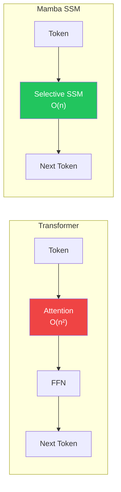
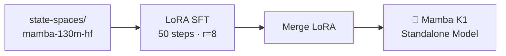
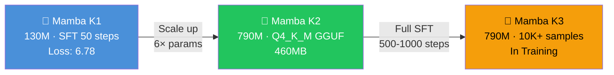

---
language:
  - en
license: apache-2.0
tags:
  - mamba
  - ssm
  - neuralai
  - text-generation
  - custom-model
  - fine-tuned
library_name: transformers
pipeline_tag: text-generation
model-index:
  - name: Mamba K1
    results: []
---

# 🧬 Mamba K1 — NeuralAI's First Owned Base Model

> **Published**: July 31, 2026 · **Last Updated**: August 1, 2026

<p align="center">
  
  
  
  
</p>

<p align="center">
  <a href="https://huggingface.co/Subject-Emu-5259/NeuralAI-Mamba-K1"></a>
  <a href="https://github.com/Subject-Emu-5259/NeuralAI"></a>
  <a href="https://huggingface.co/Subject-Emu-5259/NeuralAI-Mamba-K2"></a>
</p>

---

## 📋 Overview

**Mamba K1** is NeuralAI's **first independently owned base language model**. Unlike the SmolLM2-based Air series (which fine-tune someone else's pre-trained base), Mamba K1 is a fully merged standalone model — NeuralAI owns every weight end-to-end.

| Field | Value |
|-------|-------|
| **Model ID** | `mamba-k1` |
| **Architecture** | Mamba SSM (State Space Model) |
| **Base** | `state-spaces/mamba-130m-hf` |
| **Parameters** | 129 million |
| **Built by** | De'Andrew Harris · Gemini (Google AI Studio/Colab) |
| **Owned by** | NeuralAI |
| **Stage** | Proof of Concept v1 |
| **HF Repo** | [Subject-Emu-5259/NeuralAI-Mamba-K1](https://huggingface.co/Subject-Emu-5259/NeuralAI-Mamba-K1) |

---

## 🧪 What Makes It Different

Mamba models use **Selective State Space Models (SSMs)** instead of attention. This is fundamentally different from transformers:



| Property | Transformer | Mamba SSM |
|----------|------------|-----------|
| Complexity | \(O(n^2)\) attention | \(O(n)\) linear |
| Memory scaling | Quadratic with length | Linear with length |
| Long context | Struggles without tricks | Naturally efficient |
| Architecture age | 2017 (mature) | 2023 (emerging) |

---

## 🏋️ Training



| Parameter | Value |
|-----------|-------|
| **Method** | Supervised Fine-Tuning (SFT) via TRL |
| **Base Architecture** | Mamba-130M (SSM, not Transformer) |
| **Training Data** | UltraChat (1,000 samples) |
| **Steps** | 50 |
| **Final Loss** | 6.78 |
| **LoRA Rank** | r=8, alpha=16 |
| **Target Modules** | `in_proj`, `dt_proj`, `x_proj` |
| **DeepSpeed** | ZeRO Stage 3 |
| **Framework** | TRL 1.9.2 · Transformers 5.13.1 · PyTorch 2.11 |

---

## 📊 Current Performance

| Metric | Value |
|--------|-------|
| **Tokens/sec (CPU)** | ~19 |
| **Training loss** | 6.78 |
| **Generation quality** | ⚠️ Undergrained — loops, echoes, tangents |
| **Usefulness** | Demonstrates pipeline works |

> ⚠️ **Note**: 50 steps at 130M params is minimal training. Mamba K1 is a **proof of concept** — it proves the full pipeline works (Gemini training → LoRA merge → local inference) but the output quality is low. Use **Mamba K2** (790M params, Q4_K_M GGUF, 460MB) for practical inference.

---

## 🚀 Usage

### Python (Transformers)

```python
from transformers import MambaForCausalLM, AutoTokenizer
import torch

model = MambaForCausalLM.from_pretrained("Subject-Emu-5259/NeuralAI-Mamba-K1")
tokenizer = AutoTokenizer.from_pretrained("Subject-Emu-5259/NeuralAI-Mamba-K1")

inputs = tokenizer("The future of AI is", return_tensors="pt")
outputs = model.generate(**inputs, max_new_tokens=50)
print(tokenizer.decode(outputs[0]))
```

### NeuralAI Model Manager

```bash
python3 scripts/model_manager.py set mamba-k1
```

### HuggingFace Pipeline

```python
from transformers import pipeline

pipe = pipeline("text-generation", model="Subject-Emu-5259/NeuralAI-Mamba-K1")
pipe("NeuralAI is", max_new_tokens=50)
```

---

## 📈 Model Family Lineage



| Model | Params | Training | Loss | Status |
|-------|--------|----------|------|--------|
| **Mamba K1** | 130M | SFT 50 steps, 1K samples | 6.78 | ✅ Complete |
| **Mamba K2** | 790M | Q4_K_M GGUF base | — | ✅ Ready |
| **Mamba K3** | 790M | SFT 500-1000 steps, 10K+ | TBD | 🔄 Training |

---

## 🗺️ Roadmap

- [x] **v1 (K1)**: 130M SFT proof of concept
- [x] **v2 (K2)**: 790M GGUF base ready for LM Studio
- [ ] **v3 (K3)**: 500-1000 step SFT on 10K+ UltraChat samples
- [ ] **v4**: Mamba-1.4B or Mamba-2.8B base
- [ ] **Benchmarks**: Standard LLM evals (MMLU, HellaSwag, etc.)

---

## ⚠️ Limitations

- **Undertrained**: 50 steps is nowhere near enough for coherent output
- **Base model size**: 130M is very small by modern standards (most LLMs are 1B+)
- **Tokenizer**: GPT-NeoX (20B) — same as Pythia, not Llama
- **No chat template**: The base model has no instruction formatting
- **Mamba SSM constraints**: Cannot use standard llama.cpp GGUF conversion tools

---

## 👤 Credits

Built by **De'Andrew Preston Harris** with **Google Gemini** (AI Studio & Colab), July 2026.

From Memphis, Tennessee. Raised in West Memphis, Arkansas.

- [LinkedIn](https://linkedin.com/in/deandrewharris94/)
- [GitHub](https://github.com/Subject-Emu-5259)
- [HuggingFace](https://huggingface.co/Subject-Emu-5259)
